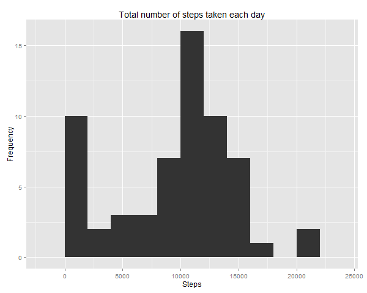
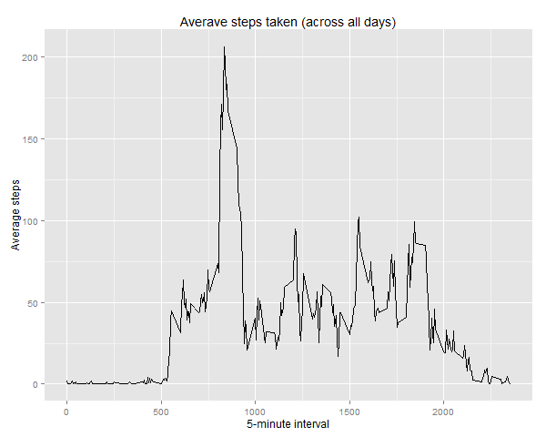
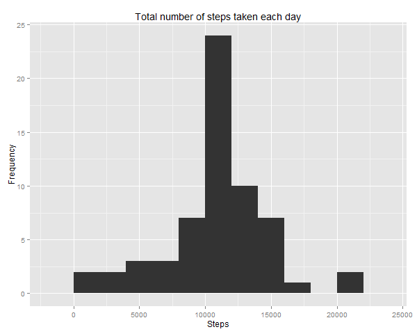
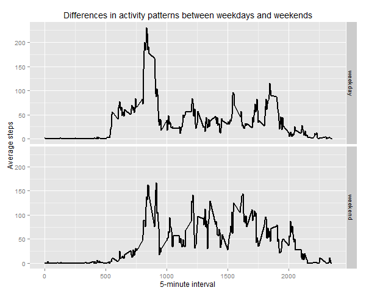

## Loading and preprocessing the data
> Load the data (i.e. read.csv())

Unzip dataset given into current working directory.
Set default working directory in RStudio by using command setwd().
Dataset 'dataActivity' will be used to store data file.

```r
setwd("C:/Users/Coursera/Module5/Assignment2/RepData_PeerAssessment1")
dataActivity <- read.csv(file="activity.csv", header=TRUE, sep=",")
```

> Process/transform the data (if necessary) into a format suitable for your analysis

View data attributes and structure

```r
head(dataActivity)
str(dataActivity)
```

## What is mean total number of steps taken per day?
> Calculate the total number of steps taken per day

```r
steps_daily <- aggregate(x = dataActivity$steps , by = list(dataActivity$date), FUN = sum ,na.rm=TRUE)
names(steps_daily) <- c("date","steps")
```

> If you do not understand the difference between a histogram and a barplot, research the difference between them. Make a histogram of the total number of steps taken each day

```r
library(ggplot2)
ggplot(steps_daily,aes(x = steps)) + ggtitle("Total number of steps taken each day") + 
  xlab("Steps") + ylab("Frequency") + geom_histogram(binwidth = 2000)
```

```
Save as PNG
```

```r
dev.copy(png, file="plotting_graph/1_historam.png", height=480, width=600)
dev.off()
```

Plotting result:

 

> Calculate and report the mean and median of the total number of steps taken per day

```r
mean(steps_daily$steps, na.rm=TRUE)
```

```
## [1] 9354.23
```

```r
median(steps_daily$steps, na.rm=TRUE)
```

```
## [1] 10395
```

Average (Mean) number of steps per day is **9354.23**

The median number of steps per day is **10,395**


## What is the average daily activity pattern?
> Make a time series plot (i.e. type = "l") of the 5-minute interval (x-axis) and the average number of steps taken, averaged across all days (y-axis)

```r
steps_average <- aggregate(x = dataActivity$steps , by = list(dataActivity$interval), FUN = mean ,na.rm=TRUE)
names(steps_average) <- c("interval","steps")
ggplot(steps_average,aes(interval,steps)) +
  ggtitle("Averave steps taken (across all days)") +
  xlab("5-minute interval") + ylab("Average steps") +
  geom_line()
```

```
Save as PNG
```

```r
dev.copy(png, file="plotting_graph/2_time_series_plot.png", height=480, width=600)
dev.off()
```

Plotting result:

 

> Which 5-minute interval, on average across all the days in the dataset, contains the maximum number of steps?

```r
max_steps <- steps_average[which(steps_average$steps == max(steps_average$steps)), ]
max_steps$interval
```

```
##    interval    steps
## 104      835 206.1698
```

## Imputing missing values
Note that there are a number of days/intervals where there are missing values (coded as NA). The presence of missing days may introduce bias into some calculations or summaries of the data.

> Calculate and report the total number of missing values in the dataset (i.e. the total number of rows with NAs)

```r
dataActivity_NA <- sum(is.na(dataActivity))
dataActivity_NA
```

Total missing values:

```
## 2304
```

> Devise a strategy for filling in all of the missing values in the dataset. The strategy doesnot need to be sophisticated. For example, you could use the mean/median for that day, or the mean for that 5-minute interval, etc.

Replace each missing value with the mean value of its 5-minute interval

```r
StepsAverage <- aggregate(steps ~ interval, data = dataActivity, FUN = mean)
fillNA <- numeric()
for (i in 1:nrow(dataActivity)) {
  obs <- dataActivity[i, ]
  if (is.na(obs$steps)) {
    steps <- subset(StepsAverage, interval == obs$interval)$steps
  } else {
    steps <- obs$steps
  }
  fillNA <- c(fillNA, steps)
}
```

> Create a new dataset that is equal to the original dataset but with the missing data filled in.

```r
dataActivity_filledNA <- dataActivity
dataActivity_filledNA$steps <- fillNA
```

> Make a histogram of the total number of steps taken each day and Calculate and report the mean and median total number of steps taken per day. Do these values differ from the estimates from the first part of the assignment? What is the impact of imputing missing data on the estimates of the total daily number of steps?

```r
StepsAverage_NA <- aggregate(steps ~ date, data = dataActivity_filledNA, sum, na.rm = TRUE)

ggplot(StepsAverage_NA,aes(x = steps)) + ggtitle("Total number of steps taken each day") + 
  xlab("Steps") + ylab("Frequency") + geom_histogram(binwidth = 2000)
```


```
Save as PNG
```

```r
dev.copy(png, file="plotting_graph/3_histogram.png", height=480, width=600)
dev.off()
```

Plotting result:

 


The mean and median total number of steps taken per day

```r
mean(StepsAverage_NA$steps, na.rm = TRUE)
```

```
## [1] 10766.19
```

```r
median(StepsAverage_NA$steps, na.rm = TRUE)
```

```
## [1] 10766.19
```

The values of mean and median are higher compared to the original dataset in the first part of this assignment. Inputing missing data with the mean for that day will increase the total daily number of steps.

## Are there differences in activity patterns between weekdays and weekends?

For this part the weekdays() function may be of some help here. Use the dataset with the filled-in missing values for this part.

> Create a new factor variable in the dataset with two levels - "weekday" and "weekend" indicating whether a given date is a weekday or weekend day.

```r
weekday.or.weekend <- function(date) {
  day <- weekdays(date)
  if (day %in% c("Monday", "Tuesday", "Wednesday", "Thursday", "Friday"))
    return("weekday")
  else if (day %in% c("Saturday", "Sunday"))
    return("weekend")
  else
    stop("invalid date")
}
```

Indicate date whether is a weekday or weekend:

```r
dataActivity_filledNA$date <- as.Date(dataActivity_filledNA$date)
dataActivity_filledNA$day <- sapply(dataActivity_filledNA$date, FUN=weekday.or.weekend)
```

> Make a panel plot containing a time series plot (i.e. type = "l") of the 5-minute interval (x-axis) and the average number of steps taken, averaged across all weekday days or weekend days (y-axis). See the README file in the GitHub repository to see an example of what this plot should look like using simulated data.

```r
StepsAverageDifference <- aggregate(steps ~ interval + day, data=dataActivity_filledNA, mean)
ggplot(StepsAverageDifference, aes(interval, steps)) + geom_line(lwd = 1) + facet_grid(day ~ .) +
  xlab("5-minute interval") + ylab("Average steps") + labs(title = expression("Differences in activity patterns between weekdays and weekends"))
```

```
Save as PNG
```

```r
dev.copy(png, file="plotting_graph/4_time_series_plot.png", height=480, width=600)
dev.off()
```

Plotting result:

 


